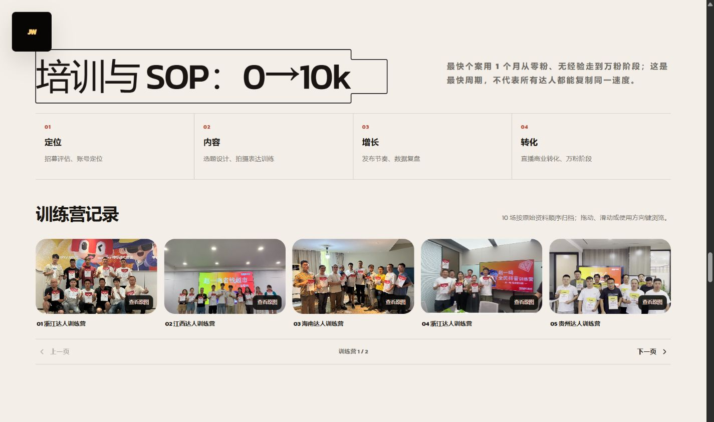
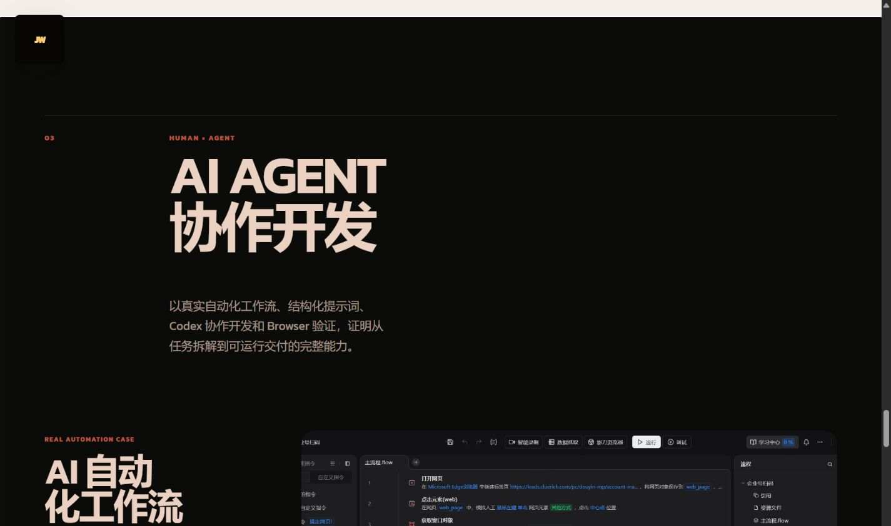
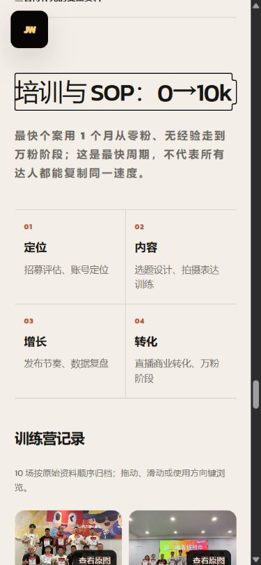
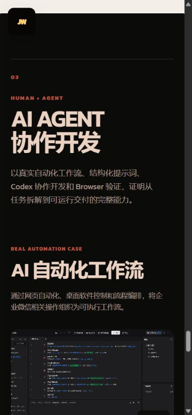

# 鸣鸣很忙案例页｜Combined Product Design Audit

## Audit scope

- 产品表面：`/cases/mingming`
- 用户目标：快速理解培训方法、浏览 30 张 IP 成绩证据，并确认 AI AGENT 的真实自动化能力。
- 捕获工具：Codex 应用内浏览器。
- 实测视口：1440×900、1280×800、1024×768、390×844、375×812。

## Overall verdict

通过。信息密度、分页关系、图片比例与移动端重排均符合本轮目标；未发现阻塞性的视觉、交互或可访问性问题。

## Numbered flow

### 1. 桌面培训与 SOP — 健康

- 4 个阶段保持一屏内可扫描；训练营 01—05 同尺寸呈现，下一页入口与 `1 / 2` 状态显式可见。
- 1440×900 下模块高度 615.6px；横图比例 1.618:1，圆角 21.6px。
- 固定 JW Logo 与锚点标题没有重叠。

### 2. 桌面普通达人成绩 — 健康

- 第一层分类清楚区分普通达人 17 与高管 13；当前分类有高对比选中态。
- 普通达人按 9 / 8 两页组织，没有首卡放大或瀑布流。
- 竖图比例 1:1.618；点击后可进入完整原图弹层。

### 3. 桌面高管成绩 — 健康

- 二级分类把 4 张主页证据和 9 张单条视频数据分开；各分组不超过两页。
- 切换复用同一展示区，不累加页面高度；证据库 1440px 宽视口下高度 1263px，小于两个 900px 视口。

### 4. 桌面 AI AGENT — 健康

- `AI AGENT / 协作开发` 建立明确双行层级，说明文本宽度受控。
- 真实 AI 自动化工作流取代作品集自截图，证据与说明一致。

### 5. 移动培训 — 健康

- 390×844 下培训路径变为紧凑 2×2；轮播每页 2 张，总计 5 页。
- 实际横向滑动可从 `1 / 5` 到 `2 / 5`，没有误开弹层或产生横向页面滚动。

### 6. 移动 AI AGENT — 健康

- 390px 与 375px 下第一行固定为 `AI AGENT`，第二行为 `协作开发`；两行均 `nowrap` 且不溢出。
- 自动化截图与正文维持清晰阅读顺序。

## Confirmed strengths

- 统一黄金比例媒体框、响应式圆角和同尺寸网格，证据密度高但结构稳定。
- Tab、Carousel、原图弹层均有可见操作入口；不依赖 hover 才能发现。
- 键盘左右键、Esc、焦点恢复、遮罩关闭和浏览器前进/后退均通过真实交互测试。
- 所有指定视口横向溢出均为 0；浏览器控制台 error / warning 均为 0。

## UX and accessibility risks

- 没有已知阻塞风险。
- 竖屏成绩缩略图在移动端用于快速识别，详细阅读仍依赖原图弹层；这是有意的渐进披露。
- 截图不能证明完整 WCAG 合规；本轮已验证键盘操作、焦点恢复、ARIA 选中态、响应式重排与程序化 reduced-motion 降级路径，但未运行屏幕阅读器和自动对比度扫描。
- 当前浏览器能力不提供强制 `prefers-reduced-motion: reduce` 模拟；真实环境报告 `no-preference`，代码中的 `useReducedMotion` 分支和 CSS 媒体查询已检查。

## Recommendation

当前版本可以交付。后续若做独立可访问性专项，可补 NVDA/VoiceOver 阅读顺序与颜色对比度测量；这不阻塞本轮验收。
